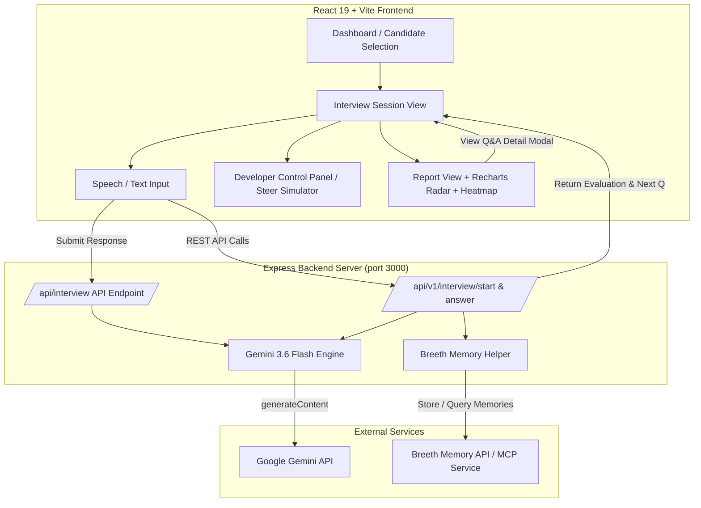

# ABTalks AI — Adaptive Technical Interviewer

An AI-powered, multi-turn adaptive technical evaluation engine that conducts personalized interviews based on a 31-Day Advanced GenAI & AI Engineering Cohort Curriculum.

---

## Overview

Traditional technical assessment tools rely on static, pre-scripted questionnaires or multiple-choice quizzes that fail to gauge true engineering depth. They ask the exact same questions regardless of a candidate's background, strengths, or previous answers.

**ABTalks AI** reimagines technical evaluation around a core philosophy: **"Build the interviewer, not the interview."**

Instead of serving static question sets, ABTalks AI acts as an active Senior Technical Interviewer powered by **Gemini 3.6 Flash**. It analyzes the candidate's learning journey, tailors questions dynamically across a **31-day AI cohort curriculum**, probes incomplete answers with adaptive follow-ups, and maintains full conversational context across an 8-turn interview session.

---

## Why ABTalks AI?

Traditional platforms evaluate candidates linearly. ABTalks AI establishes an intelligent feedback loop that continuously adapts to candidate signals:

```
Candidate Context 
  └──> Curriculum Intelligence 
         └──> Interview Planning 
                └──> Adaptive Questioning 
                       └──> Answer Evaluation 
                              └──> Follow-up Reasoning 
                                     └──> Final Report
```

* **Personalized Assessment:** Tailors questions based on candidate background, completed cohort days, target role, and past learning signals.
* **Dynamic Difficulty Scaling:** Strong answers trigger low-level architecture deep dives; partial answers trigger conceptual probing and foundational scaffolding.
* **Curriculum Grounding:** Explicitly maps and tracks candidates against 31 days of GenAI topics (from Transformers and Vector DBs to FastMCP, Fine-Tuning, and Agentic Loops).
* **Judge Steerability:** Accepts unseen judge prompts and constraints in real time (e.g., latency limits, PEP-8 compliance, security audits) without breaking active session memory.

---

## Key Features

### 1. Personalized Candidate Intelligence
Incorporates candidate profile data, completed curriculum missions, target roles (e.g., *RAG Specialist*, *AI Systems Architect*), and historical learning signals to frame relevant technical scenarios.

### 2. Curriculum-Aware Interviewing
Covers the entire 31-day ABTalks AI Cohort curriculum divided into 8 modules:
* **M1 (Days 1–4):** LLM Foundations, Tokenizer Math, Prompt Engineering, Structured JSON Mode
* **M2 (Days 5–7):** Vector DBs, HNSW vs. IVF Indexing, Cosine vs. Inner Product Math
* **M3 (Days 8–11):** Advanced RAG, Chunking, Parent-Doc, Reciprocal Rank Fusion (RRF)
* **M4 (Days 12–14):** FastMCP Protocols, Tool Schemas, Bearer OAuth, Function Calling
* **M5 (Days 15–18):** LoRA/QLoRA Fine-Tuning, Preference Tuning (DPO/PPO), Quantization
* **M6 (Days 19–22):** ReAct Loops, Plan-and-Solve, Stateful Multi-Agent Orchestration
* **M7 (Days 23–24):** System Guardrails, LlamaGuard, Input Sanitization, Prompt Injection
* **M8 (Days 25–31):** Production Ops, LangSmith Tracing, vLLM Batching, Cloud Run Serving

### 3. Multi-Turn Adaptive Interview
Guarantees a structured **8-question session** covering **at least 4 unique curriculum days**, with real-time turn-by-turn question generation powered by Gemini 3.6 Flash.

### 4. Intelligent Follow-Ups & Adaptive Branching
If a candidate gives an incomplete or partial answer, the agent generates targeted follow-up probes. When candidates excel, the system escalates question difficulty into low-level architectural mechanics.

### 5. Context & Memory Maintenance
Maintains full session history across all 8 turns. Integrated with the **Breeth Memory API** (`https://mcp.thebreeth.com/mcp` and REST memory endpoints) to persist and retrieve candidate exchange memories across questions.

### 6. Structured Evaluation Framework
Evaluates candidate answers against expected key technical points across 5 core dimensions:
1. **Technical Knowledge**
2. **Conceptual Understanding**
3. **Problem Solving**
4. **System Design**
5. **Communication**

### 7. Rich Visual Analytics
* **7-Topic Cohort Proficiency Spider Chart:** Recharts Radar visualization comparing candidates across key GenAI disciplines.
* **31-Day Curriculum Heatmap Grid:** Visually highlights tested vs. unverified days and pinpoints knowledge gaps.
* **Interactive Q&A Deep-Dive Modal:** Clicking any row in the Question Performance table opens an inspection modal displaying the exact question asked, candidate's raw response, Gemini feedback, covered vs. missed key points, and benchmark answers.

### 8. Judge Steerability & Developer Control Panel
Includes a dedicated **Developer Control Panel** allowing judges to:
* Inject live unseen requirements (*"Inject strict latency constraint (<200ms TTFT)"*, *"Require PEP-8 code style"*, *"Enforce Zero-Trust Bearer Token"*).
* Observe a real-time **Steer Adaptation Log** showing how the AI agent adjusts scoring criteria in flight.
* Use **1-Click Candidate Presets** (*High Performer*, *Needs Remediation*, *Edge Case*).
* Execute a **10-Second Fast-Forward** to skip turn-by-turn prompts and instantly generate complete 8-question evaluation reports.

---

## Challenge Requirements

| Hackathon Goal | Status | Implementation Mapping & Details | Codebase Location / Evidence |
|---|---|---|---|
| **Conversational Multi-Turn Interview** | ✅ Complete | Real-time adaptive dialogue interface supporting both speech & text input powered by Gemini 3.6 Flash. | `src/components/InterviewSessionView.tsx`, `src/lib/gemini.ts` |
| **Minimum 8 Questions** | ✅ Complete | Strictly enforces an 8-question turn sequence per evaluation session before synthesizing the final report. | `src/App.tsx`, `server.ts` (`num_questions: 8`) |
| **4+ Curriculum Days Covered** | ✅ Complete | Algorithmically tracks and enforces visiting at least 4 unique days across the 31-Day AI Cohort curriculum dataset. | `src/lib/gemini.ts` (`visited_curriculum_days`), `src/data/curriculumData.ts` |
| **Adaptive Follow-Up Probing** | ✅ Complete | Evaluates candidate answers against expected key technical points; generates targeted follow-up probes when answers lack depth or math precision. | `src/lib/gemini.ts` (`evaluateAnswerAndPlanNextTurn`) |
| **Multi-Turn Context Maintenance** | ✅ Complete | Passes full transcript and turn history to Gemini on every turn; persists candidate exchange memories via Breeth Memory API. | `src/lib/breethMemory.ts`, `server.ts` |
| **Structured & Actionable Feedback** | ✅ Complete | Synthesizes an overall mastery score, 5-dimension competency breakdown, verified strengths, areas requiring remediation, and actionable learning steps. | `src/components/InterviewReportView.tsx`, `src/lib/gemini.ts` |
| **Required HTTP Endpoints** | ✅ Complete | Exposes required `POST /api/interview` benchmark entry point along with REST routes (`/api/v1/interview/start`, `/api/v1/interview/answer`, `/api/v1/interview/:id/report`). | `server.ts` |
| **31-Day Cohort Curriculum Data** | ✅ Complete | Grounded in official 31-day curriculum JSON covering 8 core modules (RAG, Vector DBs, FastMCP, Fine-Tuning, Agentic Loops, Guardrails, Production Ops). | `src/data/curriculumData.ts` |
| **Judge Steerability / Live Constraints** | ✅ Complete | Accepts unseen judge prompts (e.g. latency caps, PEP-8 constraints) and dynamically adjusts system prompt criteria in real time without session reset. | `src/components/DeveloperControlPanel.tsx` |

---

## How The Interview Works

```
                        ┌────────────────────────┐
                        │   Candidate Profile    │
                        └───────────┬────────────┘
                                    │
                                    ▼
                        ┌────────────────────────┐
                        │  Curriculum & History  │
                        └───────────┬────────────┘
                                    │
                                    ▼
                        ┌────────────────────────┐
                        │  Adaptive Questioning  │
                        │   (Gemini 3.6 Flash)   │
                        └───────────┬────────────┘
                                    │
                                    ▼
                        ┌────────────────────────┐
                        │   Candidate Answer     │
                        └───────────┬────────────┘
                                    │
                                    ▼
                        ┌────────────────────────┐
                        │   Answer Evaluation    │
                        │ & Key Point Matching   │
                        └───────────┬────────────┘
                                    │
                        ┌───────────┴────────────┐
                        ▼                        ▼
              [ Score < 50% ]             [ Score > 80% ]
              Conceptual Probe           Escalate Difficulty
                        │                        │
                        └───────────┬────────────┘
                                    │
                                    ▼
                        ┌────────────────────────┐
                        │ Breeth Memory Persist  │
                        └───────────┬────────────┘
                                    │
                                    ▼
                        ┌────────────────────────┐
                        │   Next Question /      │
                        │   Final Report (Q8)    │
                        └────────────────────────┘
```

### Turn Lifecycle
1. **Selection:** System initializes candidate state and queries Breeth Memory for historical context.
2. **Question Generation:** Gemini 3.6 Flash generates Question 1 based on candidate's completed/skipped curriculum days.
3. **Answer & Evaluation:** Candidate submits text or voice answer. Gemini evaluates accuracy, completeness, and terminology against expected key points.
4. **Adaptive Branching:** If the answer is weak, an adaptive probe is triggered. If strong, difficulty scales to Hard/System Design.
5. **Memory Persistence:** Exchange is saved to Breeth Memory API and local session history.
6. **Report Synthesis:** Upon completing Turn 8, Gemini synthesizes the comprehensive evaluation report.

---

## Adaptive Interview Example

### Turn 1 — Core Question
> **Interviewer (AI):** *"Question 1 of 8 (Day 8 - RAG Architecture & Chunking): How does a Parent-Document Retriever differ from standard fixed-size chunking in RAG pipelines?"*
> 
> **Candidate Answer:** *"Parent-Document Retriever splits text into small chunks for embedding search, but returns the larger parent document to the LLM context."*

### Adaptive Branching (Score: 65% — Partial Answer)
> **Gemini Evaluation:** *"Good high-level concept, but missed explaining how chunk sizes are configured and how vector database storage handles parent vs child ID mapping."*
>
> **Follow-Up Probe:** *"How do you handle ID mapping between small child vector embeddings and parent document store chunks in production?"*

### Next Turn — Escalated Question (After Strong Response)
> **Interviewer (AI):** *"Question 2 of 8 (Day 10 - Reciprocal Rank Fusion): Since you demonstrated strong understanding of RAG chunking, explain the mathematical formula for Reciprocal Rank Fusion (RRF) when combining dense vector search with sparse BM25 lexical search."*

---

## Evaluation System

Final evaluation reports assess candidate readiness across 5 core dimensions:

1. **Technical Knowledge:** Mastery of mathematical formulas, code syntax, and protocols.
2. **Conceptual Understanding:** Clarity on architectural trade-offs, chunking strategies, and indexing logic.
3. **Problem Solving:** Ability to debug failures, handle edge cases, and reason through system bottlenecks.
4. **System Design:** Production readiness, scaling vector databases, and multi-agent graph design.
5. **Communication:** Structural clarity, concise explanations, and terminology precision.

Report outputs include:
* Overall Mastery Score (0–100%) and Grade Label (*Mastery*, *Excellent*, *Competent*, *Needs Revision*)
* Verified Technical Strengths (3+ bullet points)
* Areas Requiring Remediation (3+ bullet points)
* Actionable Learning Plan with recommended labs/modules
* Concise Executive Summary Paragraph

---

## Visual Analytics

* **Radar / Spider Chart:** Interactive 7-topic skill vector map built with Recharts (`RAG Search`, `Vector DBs`, `Prompts & Context`, `Agentic Loops`, `MCP & Auth`, `AI Ops / Tracing`, `Production Systems`).
* **31-Day Curriculum Heatmap Grid:** Visually categorizes all 31 cohort days into *Tested & Passed (80%+)*, *Tested & Review Needed (<80%)*, *Completed Baseline*, and *Unverified Knowledge Gap*.
* **Interactive Q&A Inspection Modal:** Modal displaying exact questions, raw responses, Gemini feedback, covered/missed points, and benchmark answers for all 8 turns.

---

## API Specification

### Benchmark Single Entry Point
#### `POST /api/interview`
Automated benchmark entry point supporting session initialization, answer submission, and feedback generation.

**Request Payload (Initialization):**
```json
{
  "candidate_id": "sana-khan",
  "action": "start"
}
```

**Response Payload:**
```json
{
  "reply": "Welcome Sana Sheikh! I am your Senior AI Technical Interviewer...\n\nQuestion 1 (Day 5 - Vector DBs & Embeddings Math):\nExplain the mathematical difference between Cosine Similarity and Inner Product.",
  "done": false
}
```

**Request Payload (Answer Submission):**
```json
{
  "session_id": "intv-1723089600000",
  "message": "Cosine similarity normalizes vectors by their L2 norm, measuring angle, while inner product includes magnitude."
}
```

---

### REST API Endpoints

#### 1. Start Interview
`POST /api/v1/interview/start` or `POST /api/interview/start`

**Request:**
```json
{
  "candidate_id": "sana-khan",
  "num_questions": 8
}
```

**Response:**
```json
{
  "status": "success",
  "session_id": "intv-1723089600000-a1b2c",
  "candidate": {
    "id": "sana-khan",
    "name": "Sana Sheikh",
    "role": "Senior RAG Specialist"
  },
  "session": {
    "total_questions": 8,
    "current_question_number": 1,
    "visited_curriculum_days": [5],
    "status": "in_progress"
  },
  "question": {
    "id": "q-gen-1723089600000-0",
    "day": 5,
    "module": "M2: Vector DBs",
    "topic": "Vector DBs & Embeddings Math",
    "questionText": "Explain the difference between HNSW and IVF vector index types.",
    "difficulty": "Medium",
    "type": "Conceptual"
  }
}
```

#### 2. Submit Answer & Progress
`POST /api/v1/interview/answer` or `POST /api/interview/respond`

**Request:**
```json
{
  "session_id": "intv-1723089600000-a1b2c",
  "candidate_response": "HNSW builds a multi-layer graph for fast log(N) traversal, while IVF partitions vector space into Voronoi cells using k-means clustering."
}
```

**Response:**
```json
{
  "status": "success",
  "is_complete": false,
  "session_id": "intv-1723089600000-a1b2c",
  "current_question_index": 2,
  "visited_curriculum_days": [5, 8],
  "breeth_memory_persisted": true,
  "evaluation": {
    "score": 92,
    "label": "Excellent",
    "feedback": "Outstanding answer covering structural graph traversal vs space partitioning.",
    "key_points_covered": ["Multi-layer graph structure", "Voronoi cell partitioning"],
    "key_points_missed": []
  },
  "next_question": {
    "question_number": 2,
    "total_questions": 8,
    "question": {
      "day": 8,
      "module": "M3: Advanced RAG",
      "topic": "RAG Architecture & Chunking",
      "questionText": "Building on your strong vector indexing knowledge, how would you design a hybrid BM25 + dense vector search pipeline?",
      "difficulty": "Hard",
      "type": "System Design"
    }
  }
}
```

#### 3. Retrieve Final Report
`GET /api/v1/interview/:id/report` or `GET /api/interview/report/:session_id`

**Response:**
```json
{
  "status": "success",
  "session_id": "intv-1723089600000-a1b2c",
  "overall_readiness": 91,
  "score_breakdown": {
    "technicalKnowledge": 94,
    "conceptualUnderstanding": 91,
    "problemSolving": 89,
    "systemDesign": 88,
    "communication": 95
  },
  "strengths": [
    "Deep technical mastery of RAG & HNSW vector indexing math",
    "Flawless FastMCP authorization & tool schema definition"
  ],
  "weak_areas": [
    "Minor edge case handling in multi-agent cyclic graph execution"
  ],
  "actionable_next_steps": [
    "Deploy custom FastMCP server with authorization middleware",
    "Set up LangSmith tracing for TTFT monitoring"
  ],
  "visited_curriculum_days": [5, 8, 12, 16, 20, 24, 28, 30]
}
```

#### 4. Export Webhook (ATS Integration)
`POST /api/v1/interview/export-webhook`

Dispatches candidate report payloads directly to external ATS (e.g., Greenhouse, Lever) or HR endpoints.

#### 5. OpenAPI Specification & Curriculum Info
* `GET /api/v1/spec`: Complete OpenAPI 1.0.0 specification
* `GET /api/v1/curriculum`: Returns full 31-day curriculum JSON data
* `GET /api/v1/candidates`: Returns candidate profiles and learning progress

---

## Tech Stack

* **Frontend Framework:** React 19, TypeScript, Vite 6
* **Styling & UI:** Tailwind CSS 4, Lucide Icons, Canvas Confetti
* **Data Visualization:** Recharts (Radar / Spider Charts)
* **AI Model Engine:** `@google/genai` SDK with **Gemini 3.6 Flash** (`gemini-3.6-flash` model with fallback heuristic engine)
* **Backend Server:** Express 4 on Node.js (transpiled with `tsx` in dev, bundled into standalone `dist/server.cjs` via `esbuild` for production)
* **Memory Integration:** Breeth Memory API (`https://mcp.thebreeth.com/mcp` and REST memory storage endpoints)

---

## Architecture



---

## Project Structure

```
.
├── server.ts                       # Express backend server with API endpoints
├── src/
│   ├── main.tsx                    # React entry point
│   ├── App.tsx                     # Main application routing & session state
│   ├── types.ts                    # TypeScript interface definitions
│   ├── index.css                   # Global CSS & Tailwind imports
│   ├── components/
│   │   ├── Header.tsx              # Navigation bar with Steer Panel trigger
│   │   ├── Dashboard.tsx           # Candidate selector & cohort overview
│   │   ├── DeveloperControlPanel.tsx# Steer Challenge simulator & presets
│   │   ├── InterviewSessionView.tsx# Live multi-turn evaluation interface
│   │   ├── InterviewReportView.tsx # Visual report, Radar chart, Heatmap & Q&A Modal
│   │   ├── TechSpecModal.tsx       # Technical architecture specification
│   │   └── AuthModal.tsx           # Authentication modal
│   ├── data/
│   │   ├── candidateProfiles.ts    # Synthetic cohort candidate profiles
│   │   ├── curriculumData.ts       # 31-day AI Cohort curriculum dataset
│   │   └── sampleQuestions.ts      # Sample question bank
│   └── lib/
│       ├── gemini.ts               # Gemini 3.6 Flash evaluation & question engine
│       └── breethMemory.ts         # Breeth Memory API REST & MCP RPC client
├── .env.example                    # Environment variable template
├── package.json                    # Project dependencies and build scripts
├── vite.config.ts                  # Vite configuration
└── README.md                       # Documentation
```

---

## Getting Started

### Prerequisites
* Node.js 18 or higher
* npm or yarn

### Installation & Setup

1. **Clone the repository:**
   ```bash
   git clone <repository-url>
   cd ai-cohort-examiner
   ```

2. **Install dependencies:**
   ```bash
   npm install
   ```

3. **Configure Environment Variables:**
   Create a `.env` file in the root directory (refer to `.env.example`):
   ```env
   GEMINI_API_KEY=your_gemini_api_key_here
   BREETH_API_KEY=your_breeth_api_key_here
   ```

4. **Run Development Server:**
   ```bash
   npm run dev
   ```
   The application and API will run on `http://localhost:3000`.

5. **Build for Production:**
   ```bash
   npm run build
   npm start
   ```

---

## Environment Variables

| Variable | Description | Required |
|---|---|---|
| `GEMINI_API_KEY` | Google Gemini API Key (used for Gemini 3.6 Flash evaluation and adaptive question generation) | Highly Recommended (falls back to heuristic engine if missing) |
| `BREETH_API_KEY` | Breeth Memory API Key (used for persisting candidate memories to Breeth MCP service) | Optional (falls back to local session history if missing) |

*Note: Never commit actual secret keys to git repositories.*

---

## Demo Walkthrough

### 2-Minute Judge Demo Script

1. **Select Candidate Profile:** On the Dashboard, choose **Sana Sheikh** (*Senior RAG Specialist*) or **Zobiya Khan** (*AI Systems Architect*). Notice their completed vs. skipped curriculum days.
2. **Start Interview:** Click **"Start AI Technical Interview"**. The system loads candidate context and generates Question 1 on Vector DBs (Day 5).
3. **Demonstrate Adaptive Follow-Up:** Type a partial answer (e.g., *"HNSW uses graphs for vector search"*). Observe Gemini evaluating key points missed and generating a targeted follow-up probe.
4. **Demonstrate Difficulty Escalation:** Type a detailed answer for Question 2. Observe Gemini rating it *Excellent (92%)* and escalating Question 3 into system design architecture.
5. **Open Steer Panel (Judges Special):** Click **"Steer Panel"** in the top navigation bar.
   * Type a judge requirement in the input box: *"Inject strict latency constraint (<200ms TTFT)"*.
   * Click **Inject**. Observe the live **Steer Adaptation Log** update in real time.
6. **Fast-Forward to Final Report:** Click **"Fast-Forward to Turn 8"** in the control panel. In <10 seconds, the engine completes all 8 turns.
7. **Explore Visual Analytics:**
   * Review the **Overall Mastery Score Gauge** and **5-Dimension Competency Bars**.
   * Inspect the **7-Topic Cohort Proficiency Spider Chart** (Recharts Radar).
   * Examine the **31-Day Curriculum Heatmap Grid** showing tested vs. gap days.
   * Click any row in the **Question Performance Breakdown** table to open the **Q&A Deep-Dive Modal**, inspecting the exact question, candidate answer, Gemini feedback, and benchmark answer.

---

## Security & Best Practices

* **Server-Side API Proxying:** Gemini API calls are made exclusively on the backend (`server.ts` and `src/lib/gemini.ts`), keeping API keys hidden from client browser bundles.
* **Input Validation & Sanitization:** All user text submissions are validated and safely handled before being passed to AI prompts or API responses.
* **Fallback Degradation:** If API rate limits occur or keys are omitted, the application seamlessly degrades to a structured local heuristic scoring engine without crashing.

---

## Limitations & Future Enhancements

### Current Limitations
* Session state is stored in memory (`Map`) on the server; restarting the server clears active uncompleted sessions.
* Voice input relies on browser Web Speech APIs (supported in Chrome/Edge/Safari).

### Future Roadmap
* Persistent database storage (Firestore / PostgreSQL) for multi-session historical trending.
* Full-duplex streaming audio using Gemini Live API.
* Multi-interviewer panel mode (evaluating candidates with distinct AI interviewer personas simultaneously).

---

## License

Distributed under the MIT License.
